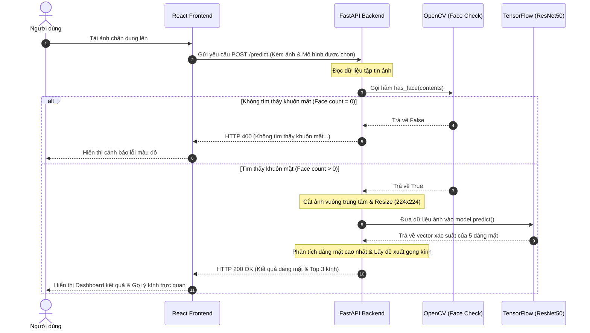

# 🕶️ FaceFit AI — Hệ Thống Gợi Ý Mắt Kính Thông Minh Bằng AI

<div align="center">
  
  
  <p align="center">
    <strong>Giải pháp nhận diện dáng khuôn mặt bằng Deep Learning và đề xuất gọng kính phù hợp theo tỷ lệ hình học.</strong>
  </p>

  <p align="center">
    <a href="https://github.com/nguyenvandiennlu/FaceAI_Nhom22"></a>
    
    
    
    
    
    
  </p>
</div>

---

## 📖 Giới thiệu dự án

**FaceFit AI** là một ứng dụng web cao cấp giúp giải quyết vấn đề chọn kính phù hợp với khuôn mặt bằng trí tuệ nhân tạo. Hệ thống chụp/nhận ảnh trực diện của người dùng, tự động kiểm tra tính hợp lệ bằng bộ lọc phát hiện khuôn mặt (**OpenCV Haar Cascade**), chuẩn hóa tỷ lệ ảnh và sử dụng mạng nơ-ron tích chập **ResNet50** chạy song song để dự đoán chính xác dáng mặt.

Dựa trên kết quả dáng mặt, ứng dụng sẽ đề xuất ngay Top 3 dáng kính phù hợp nhất được lập trình theo nguyên lý cân bằng đối lập hình học thẩm mỹ thời trang.

---

## 🎨 Trực quan hóa Quy trình (Architecture Pipeline)

Bức ảnh tải lên sẽ đi qua chuỗi kiến trúc xử lý song song của hệ thống:

```
[Ảnh tải lên] ──> [OpenCV Face Filter] ──> [Center Crop] ──> [ResNet50 AI Predict] ──> [Đề xuất mắt kính]
```

_Dưới đây là sơ đồ luồng dữ liệu (Sequence Diagram) chi tiết của hệ thống:_



---

## 💻 Tech Stack (Công nghệ sử dụng)

| Thành phần           | Công nghệ                  | Chi tiết                                                                             |
| :------------------- | :------------------------- | :----------------------------------------------------------------------------------- |
| **Frontend UI**      | React 19, TypeScript       | Giao diện hiện đại, mượt mà, responsive, tương thích mọi thiết bị.                   |
| **Styling**          | Vanilla CSS, Framer Motion | Hiệu ứng chuyển động (animations) sang trọng, giao diện tối mờ kính (glassmorphism). |
| **Đa ngôn ngữ**      | i18next & react-i18next    | Chuyển đổi ngôn ngữ Tiếng Việt / Tiếng Anh tức thì toàn trang.                       |
| **Backend API**      | FastAPI (Python)           | Server API hiệu năng cao, xử lý dữ liệu bất đồng bộ.                                 |
| **Machine Learning** | TensorFlow 2.x, Keras      | Chạy mô hình ResNet50 phân loại dáng mặt với độ chính xác cao.                       |
| **Xử lý ảnh**        | OpenCV, Pillow             | Phát hiện khuôn mặt, crop trung tâm ảnh bảo toàn tỷ lệ quai hàm.                     |

---

## 📁 Cấu trúc thư mục (Folder Tree)

```text
FaceAI_Nhom22/
├── backend/                               # --- BACKEND (Python) ---
│   ├── app.py                             # File chạy FastAPI chính, load model & predict
│   ├── haarcascade_frontalface_default.xml # File mẫu OpenCV phát hiện khuôn mặt
│   ├── requirements.txt                   # Danh sách thư viện Python cần cài đặt
│   └── resnet50_faceshape.keras           # File mô hình học máy 286MB (được gitignore chặn)
├── src/                                   # --- FRONTEND (React) ---
│   ├── components/                        # Các thành phần giao diện (Navbar, Upload, Dashboard...)
│   ├── services/                          # File kết nối API (api.ts)
│   ├── types/                             # Khai báo kiểu dữ liệu TypeScript
│   ├── App.tsx                            # Component gốc bọc ứng dụng
│   ├── i18n.ts                            # Cấu hình đa ngôn ngữ Tiếng Việt / Tiếng Anh
│   └── index.css                          # Cấu hình phong cách giao diện toàn dự án
├── .gitignore                             # Cấu hình chặn đẩy file nặng/môi trường lên GitHub
├── package.json                           # Các dependencies của Node.js
├── pnpm-lock.yaml                         # Đồng bộ hóa các phiên bản gói thư viện frontend
└── README.md                              # Tài liệu hướng dẫn sử dụng dự án
```

---

## 🛠️ Hướng dẫn cài đặt & Khởi chạy

### 1. Thiết lập Backend (Python)

Yêu cầu máy đã cài **Python 3.9 - 3.11** và **pip**.

1. **Di chuyển vào thư mục backend:**
   ```bash
   cd backend
   ```
2. **Khởi tạo môi trường ảo Python (venv):**
   ```bash
   python -m venv venv
   ```
3. **Kích hoạt môi trường ảo:**
   - _Windows (PowerShell):_ `.\venv\Scripts\Activate.ps1`
   - _Windows (CMD):_ `.\venv\Scripts\activate.bat`
   - _macOS / Linux:_ `source venv/bin/activate`
4. **Cài đặt các thư viện cần thiết:**
   ```bash
   pip install -r requirements.txt
   ```
5. **Nạp file mô hình AI:**
   - Hãy tải file mô hình **`resnet50_faceshape.keras`** (nặng 286MB) và đặt trực tiếp vào trong thư mục `/backend`.
6. **Khởi chạy Backend Server:**
   ```bash
   python app.py
   ```
   _Server chạy tại cổng: `http://localhost:8000/`_

---

### 2. Thiết lập Frontend (React + Vite)

Yêu cầu máy đã cài **Node.js (v18+)** và **pnpm** (hoặc **npm**).

1. **Di chuyển về thư mục gốc dự án:**
   ```bash
   cd ..
   ```
2. **Cài đặt các gói thư viện (Dependencies):**
   - _Bằng pnpm (Khuyên dùng):_ `pnpm install`
   - _Bằng npm:_ `npm install`
3. **Cấu hình biến môi trường kết nối API:**
   - Tạo file `.env` ở thư mục gốc và đảm bảo dòng cấu hình sau được bật để kết nối API thật:
     ```env
     VITE_USE_MOCK=false
     ```
4. **Khởi chạy Frontend Dev Server:**
   - _Bằng pnpm:_ `pnpm dev`
   - _Bằng npm:_ `npm run dev`
   - _Giao diện ứng dụng chạy tại cổng: `http://localhost:5173/`_

---

## 🔌 Đặc tả API Endpoints (FastAPI)

### 1. Phân tích khuôn mặt & Gợi ý kính

- **Endpoint:** `POST /predict`
- **Định dạng dữ liệu gửi đi:** `multipart/form-data`
  - Tham số: `file` (File ảnh chụp trực diện khuôn mặt).
- **Mã lỗi phản hồi:**
  - `400 Bad Request`: Khi ảnh tải lên bị lỗi hoặc không tìm thấy khuôn mặt rõ ràng (Face count = 0).
- **Dữ liệu trả về mẫu (JSON 200 OK):**
  ```json
  {
    "face_shape": "Round",
    "confidence": 0.945,
    "best_model": "ResNet50 Custom Model",
    "probabilities": {
      "Heart": 0.012,
      "Oblong": 0.003,
      "Oval": 0.04,
      "Round": 0.945,
      "Square": 0.0
    },
    "recommendations": [
      {
        "id": "rec-4",
        "name": "Sharp Square Frames",
        "frame": "Rectangle",
        "score": 96,
        "description": "Contrasts round features, making the face look longer."
      }
    ]
  }
  ```

### 2. Lấy danh sách mô hình

- **Endpoint:** `GET /models`
- **Dữ liệu trả về:** Danh sách thông tin, độ chính xác, tốc độ suy luận của 4 mô hình AI trong hệ thống.

---

## 🛡️ License

Dự án này được phân phối dưới giấy phép **MIT License**.

## 👥 Nhóm tác giả thực hiện (Nhóm 22)

Dự án được hoàn thành với sự đóng góp tích cực của các thành viên Nhóm 22 - Đại học Nông Lâm TP.HCM (NLU):

- **Thân Văn Danh** (MSSV: `23130043`) — **Nhóm trưởng** & Quản lý dự án / Phát triển Mô hình AI
- **Nguyễn Văn Điền** (MSSV: `23130061`) — **Thành viên** & Phát triển Mô hình AI / Giao diện Frontend

---

_Cảm ơn bạn đã quan tâm đến dự án FaceFit AI!_ 🕶️
